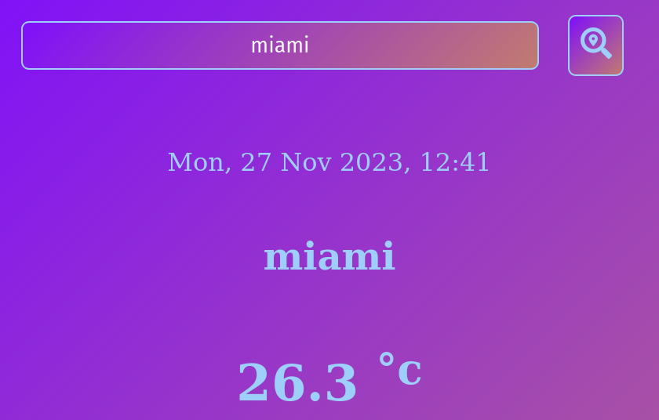
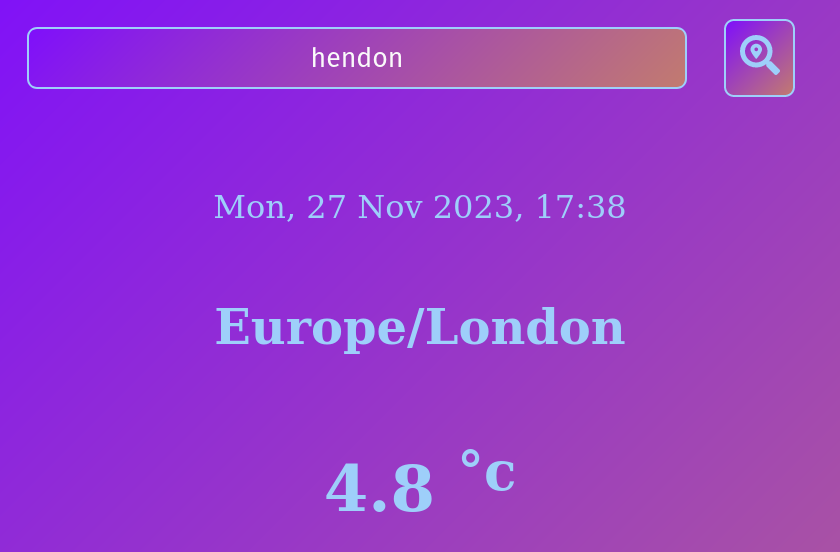
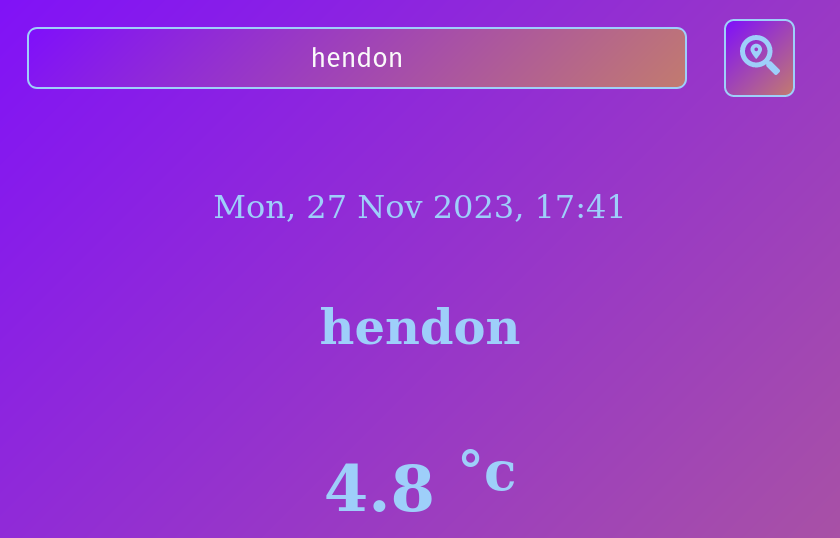

# Testing

***

Return back to the [README.md](README.md) file.

***

## Code Validation

### HTML

- I have used the recommended [HTML W3C Validator](https://validator.w3.org) to validate all of my HTML files.
- All files were validated using the live deployed site pages.
- It was noted that all pages had the same error of 1 x closing div missing from the nav section. This was due to the code being re-used from the index file before correction.
- The confirmation page had a space missing from content in the refresh meta tag.
- All errors have been corrected as shown in the table below.

| Page | W3C URL | Screenshot errors | Screenshot fixed | Notes |
| --- | --- | --- | --- | --- |
| Home | [W3C](https://validator.w3.org/nu/?doc=https%3A%2F%2Fboderg.github.io%2Fthe-bread-shed%2F) |  |  | closing div tag missing from nav section - fixed |

### CSS

- I have used the recommended [CSS Jigsaw Validator](https://jigsaw.w3.org/css-validator) to validate all of my CSS files.
- The screenshot shows a pass in relation to the css file that was validated by copy and paste method.
- The copy and paste method was used because the validator is trying to validate the bootstrap elements that have been used.
- The link below is for the URL test method and shows many warnings due to the bootstrap elements and vendor specific styles used.

| File | Jigsaw URL | Screenshot | Notes |
| --- | --- | --- | --- |
| style.css | [Jigsaw](https://jigsaw.w3.org/css-validator/) |  | Pass: No Errors |

### JavaScript

-I have used the recommended [JavaScript Validator](https://jshint.com/) to validate all of my JavaScript files.

***

## Browser Compatibility

- I've tested my deployment of What is the Weather? on multiple browsers to check for compatibility issues.
- As well as checking for page functionality, all social links were tested to ensure they open in new tabs.
- Each page was tested and a screenshot taken in each of the browsers. A representation of this is shown in the table below.
- I have decided to only include testing for the two main browsers that are chromium based (Google's Chrome and Microsoft's Edge) and the two main non chromium based browsers (Mozilla's Firfox and Apple's Safari). I feel this is a more prudent approach as the vast majority of users generally use one of these four.

| Browser | Screenshot 1 | Screenshot 2 | Notes |
| --- | --- | --- | --- |
| [Chrome](https://www.google.com/chrome) |  |  | Works as expected |
| [Edge](https://www.microsoft.com/edge) |  |  | Works as expected |
| [Firefox (Developer Edition)](https://www.mozilla.org/firefox/developer) |  |  | Works as expected |
| [Safari](https://www.apple.com/uk/safari/) |  |  | Works as expected |

***

## Responsiveness

- I've tested my deployment of What is the Weather? on multiple devices to check for responsiveness issues.
- The devices tested on were presets within devtools in the chrome browser along with my own personal Samsung Galaxy S10+, 1080p standard and 1440p ultrawide monitors.

| Device | Screenshot | Screenshot | Notes |
| --- | --- | --- | --- |
| Mobile iPhone SE (DevTools) |  |  | Works as expected |

***

## Lighthouse Audit

- I've tested my deployment of What is the Weather? using the Lighthouse Audit tool to check for any major issues.
- No major issues were noted.
- Some performance issues noted due to larger content loads.
- All images compressed and converted to .webp format for faster load times.
- All script tags have been placed at the bottom of the html body for faster load times.

| Page | Size | Screenshot | Notes |
| --- | --- | --- | --- |
| Home | Mobile |  | Very few warnings |

***

## User Story Testing

I've tested my deployment of What is the Weather? to ensure that it meets the user stories listed.

| User Story | Screenshot |
| --- | --- |
| As a new site user, I would like to easily ..., so that I can .... |  |
| As a new site user, I would like to easily ..., so that I can .... |  |
| As a new site user, I would like to easily ..., so that I can .... |  |

***

## Bugs

The following are bugs that I have come across while creating the Your Weather site.

- Timezone displayed instead of city - The data being displayed was pulled from the timezone and not the city name.

| Original image | Bug fixed image |
| --- | --- |
|  |  |
|  | 

- To fix this I removed the const variable that was calling that data from the api enabling the HTML to use the place name from the input field instead.

- Initial Sunrise and Sunset times displayed as GMT timezone.

| Original image | Bug fixed image |
| --- | --- |
|  | 

- To fix this I implemented a UTC conversion to display as the timezone of the city requested.

- Mixed content - This error prevented the deployed site from loading the weather data from the api.
- To fix this error I edited all links that displayed as http:// to https://.

- Uncaught in promise error (network error) - This error was preventing the deployed site from fetching any data from the api but only while using Firefox, it was fine on other browsers.
- To fix this error I tried adding a catch to the fetch but this broke the site and after a little research it turned out that by turning off the ad blocker extension I had on firefox the api was then able to fetch the data.

## Unfixed Bugs

There are no remaining bugs that I am aware of.
